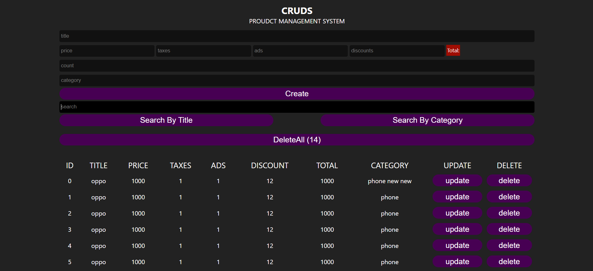

<h2>JavaScript-Crud-Project</h2>

<h4>Features</h4>
<ul>
  <li>Create products</li>
  <li>Delete product</li>
  <li>Update product</li>
  <li>Show Products</li>
  <li>Use local storage to save products</li>
  <li>Search by title of products</li>
  <li>Search by category of products</li>
</ul>

<h4>Technologies</h4>

HTML

CSS

JavaScript

